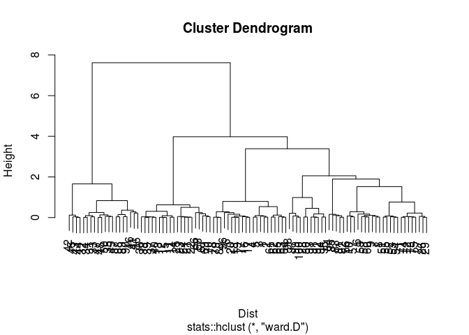
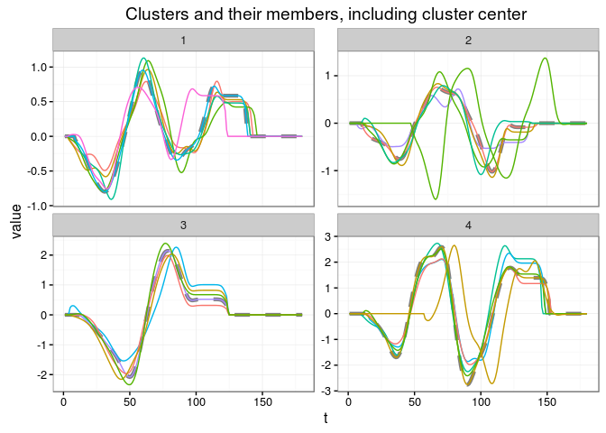

<!-- README.md is generated from README.Rmd. Please edit that file -->
Time Series Clustering With Dynamic Time Warping Distance (DTW)
===============================================================

This package attempts to consolidate some of the recent techniques related to time series clustering under DTW and implement them in `R`. Most of these algorithms make use of traditional clustering techniques (partitional and hierarchical clustering) but change the distance definition. In this case, the distance between time series is measured with DTW.

DTW is, however, computationally expensive, so several optimization techniques exist. They mostly deal with bounding the DTW distance. These bounds are only defined for time series of equal lengths. Nevertheless, if the length of the time series of interest vary only slightly, reinterpolating them to a common length is probably appropriate.

Additionally, a recently proposed algorithm called k-Shape could serve as an alternative. k-Shape clustering relies on custom distance and centroid definitions, which are unrelated to DTW. The shape extraction algorithm proposed therein is particularly interesting if time series can be z-normalized.

Many of the algorithms and optimizations require that all series have the same length. The ones that don't are usually slow but can still be used.

Please see the included references for more information.

Implementations
---------------

-   Keogh's and Lemire's lower bounds
-   DTW Barycenter Averaging
-   k-Shape clustering
-   TADPole clustering

Examples
--------

``` r
## Load data
data(uciCT)

## Reinterpolate data to equal lengths
datalist <- zscore(CharTraj)
data <- lapply(CharTraj, reinterpolate, newLength = 180)

## Common controls
ctrl <- list(window.size = 20L, trace = TRUE)

#### Using DTW with help of lower bounds and PAM centroids
ctrl$pam.precompute <- FALSE

kc.dtwlb <- dtwclust(data = data, k = 20, distance = "dtw_lb",
                     centroid = "pam", seed = 3247, 
                     control = ctrl)
#> Iteration 1: Changes / Distsum = 100 / 1639.01
#> Iteration 2: Changes / Distsum = 13 / 1307.411
#> Iteration 3: Changes / Distsum = 2 / 1290.775
#> Iteration 4: Changes / Distsum = 2 / 1287.395
#> Iteration 5: Changes / Distsum = 0 / 1287.395
#> 
#>  Elapsed time is 9.263 seconds.

plot(kc.dtwlb)
```

<!-- -->

``` r

ctrl$pam.precompute <- TRUE

#### Hierarchical clustering based on shape-based distance
hc.sbd <- dtwclust(datalist, type = "hierarchical",
                   k = 20, distance = "sbd",
                   method = "all",
                   control = ctrl)
#> 
#>  Calculating distance matrix...
#> 
#>  Performing hierarchical clustering...
#> 
#>  Elapsed time is 0.673 seconds.

cat("Rand index for HC+SBD:\n")
#> Rand index for HC+SBD:
print(ri <- sapply(hc.sbd, randIndex, y = CharTrajLabels))
#>       ARI       ARI       ARI       ARI       ARI       ARI       ARI 
#> 0.7405012 0.7034438 0.3428238 0.5302644 0.5125830 0.5746408 0.4182468 
#>       ARI 
#> 0.4196458

plot(hc.sbd[[which.max(ri)]])
```

<!-- -->

``` r

#### TADPole clustering
kc.tadp <- dtwclust(data, type = "tadpole", k = 20,
                    dc = 1.5, control = ctrl)
#> 
#> Entering TADPole...
#> 
#> TADPole completed, pruning percentage = 86.7%
#> 
#>  Elapsed time is 4.552 seconds.

plot(kc.tadp, clus = 1:4)
```

<!-- -->

``` r

#### Parallel support
require(doParallel)
#> Loading required package: doParallel
#> Loading required package: iterators
#> Loading required package: parallel
cl <- makeCluster(detectCores(), "FORK")
invisible(clusterEvalQ(cl, library(dtwclust)))
registerDoParallel(cl)

## Registering a custom distance with proxy and using it (normalized DTW)
ndtw <- function(x, y, ...) {
     dtw::dtw(x, y, step.pattern = symmetric2,
              distance.only = TRUE, ...)$normalizedDistance
}

## Registering the function with 'proxy'
proxy::pr_DB$set_entry(FUN = ndtw, names=c("nDTW"),
                       loop = TRUE, type = "metric", distance = TRUE,
                       description = "Normalized DTW with L1 norm")

## Data with different lengths
kc.ndtw <- dtwclust(datalist, k = 20,
                    distance = "nDTW", centroid = "pam",
                    seed = 159, control = new("dtwclustControl", nrep = 8L))

sapply(kc.ndtw, randIndex, y = CharTrajLabels)
#>       ARI       ARI       ARI       ARI       ARI       ARI       ARI 
#> 0.5739085 0.5798654 0.4112420 0.5351719 0.6000514 0.4897014 0.5101194 
#>       ARI 
#> 0.6715448

## DBA centroids
kc <- dtwclust(datalist, k = 20,
               distance = "nDTW", centroid = "dba",
               seed = 9421, control = list(trace = TRUE))
#> Series have different lengths. Please confirm that the provided distance function supports this.
#> Iteration 1: Changes / Distsum = 100 / 5.162033
#> Iteration 2: Changes / Distsum = 3 / 3.739462
#> Iteration 3: Changes / Distsum = 2 / 3.687197
#> Iteration 4: Changes / Distsum = 0 / 3.631238
#> 
#>  Elapsed time is 21.683 seconds.

# Modifying some plot parameters
plot(kc, labs.arg = list(title = "DBA Centroids", x = "time", y = "series"))
```

<!-- -->

``` r

stopCluster(cl)
registerDoSEQ()
```

Dependencies
------------

-   Partitional procedures are inspired by the `flexclust` package.
-   Hierarchical procedures use the native `hclust` function.
-   Cross-distances make use of the `proxy` package.
-   The core DTW calculations are done by the `dtw` package.
-   Plotting is done with the `ggplot2` package.
-   Parallel computation depends on the `foreach` package.
-   Random streams for repetitions of partitional procedures use the `doRNG` package.
